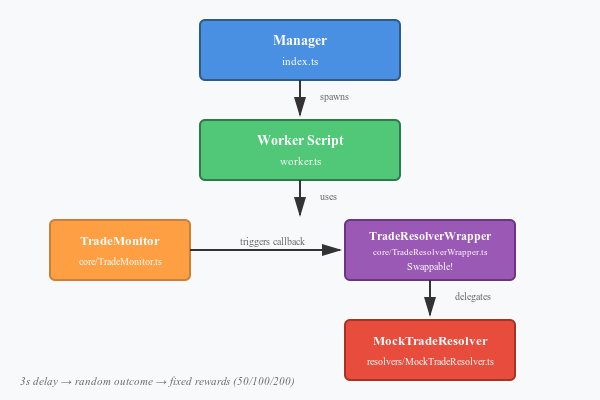

# Trade Engine Worker

## Overview
Worker pool that monitors and resolves trades. Uses **TradeMonitor** to detect new trades via callbacks, and **TradeResolverWrapper** to process them using swappable resolvers (mock/real).

## Architecture
```
index.ts (Manager)
    ↓ spawns
worker.ts (Script)
    ↓ uses
TradeMonitor → triggers callback → TradeResolverWrapper
                                        ↓ delegates to
                                   ITradeResolver (Mock/Real)
```

## Components
- **Manager** (`index.ts`): Spawns/manages worker threads
- **Worker Script** (`worker.ts`): Runs monitor + resolver
- **TradeMonitor** (`core/`): Listens for trades, triggers callbacks
- **TradeResolverWrapper** (`core/`): Wraps any resolver implementation
- **MockTradeResolver** (`resolvers/`): 3s delay, random outcome, fixed rewards

## Diagram


